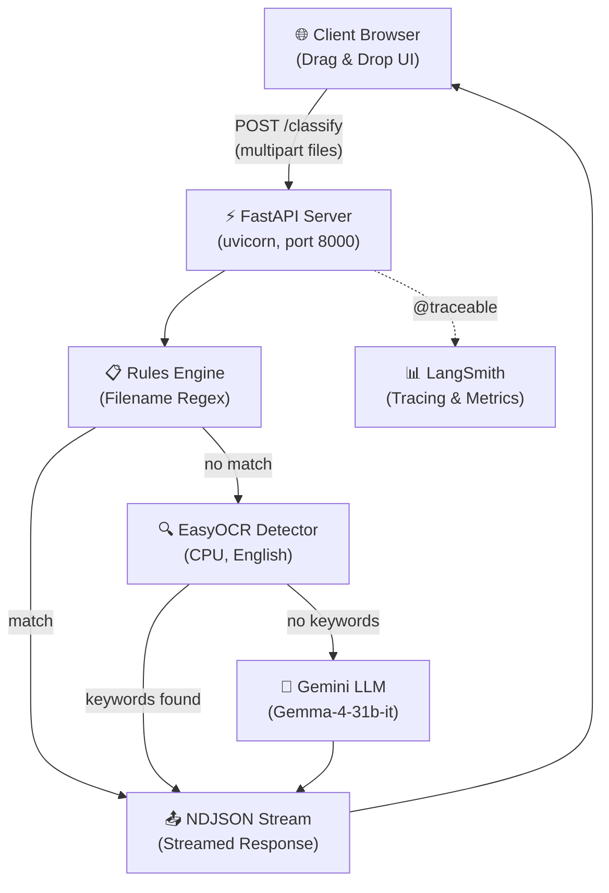
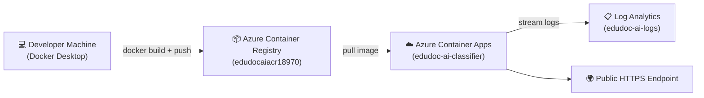
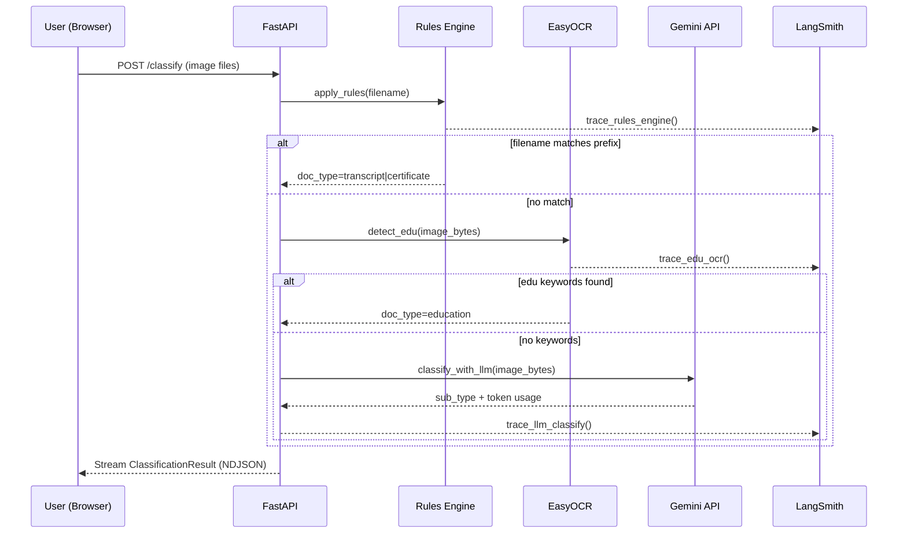

<div align="center">

# 🎓 EduDoc AI

### Intelligent Educational Document Classifier

[](https://www.python.org/)
[](https://fastapi.tiangolo.com/)
[](https://deepmind.google/technologies/gemini/)
[](https://edudoc-ai-classifier.orangebeach-0f319659.eastus.azurecontainerapps.io)
[](https://www.docker.com/)
[](https://smith.langchain.com/)
[](LICENSE)
[](https://edudoc-ai-classifier.orangebeach-0f319659.eastus.azurecontainerapps.io)

**Automatically classify scanned educational records using a cost-optimised three-stage pipeline:**
**Filename Rules → OCR → Gemini LLM**

[🚀 Live Demo](https://edudoc-ai-classifier.orangebeach-0f319659.eastus.azurecontainerapps.io) · [📖 API Docs](https://edudoc-ai-classifier.orangebeach-0f319659.eastus.azurecontainerapps.io/docs) · [🏗 Architecture](#architecture) · [⚡ Quick Start](#quick-start-local)

---

</div>

## 📋 Table of Contents

- [Overview](#-overview)
- [Classification Pipeline](#-classification-pipeline)
- [Architecture](#-architecture)
- [Project Structure](#-project-structure)
- [Quick Start (Local)](#-quick-start-local)
- [Running with Docker](#-running-with-docker)
- [API Reference](#-api-reference)
- [Frontend UI](#-frontend-ui)
- [Observability with LangSmith](#-observability-with-langsmith)
- [Deploying to Azure](#-deploying-to-azure)
- [Environment Variables](#-environment-variables)
- [Performance & Cost](#-performance--cost)
- [Contributing](#-contributing)

---

## 🎯 Overview

**EduDoc AI** automates the classification of scanned student and institutional documents for university admissions, administrative offices, and academic record management.

Instead of staff manually reviewing every uploaded scan, EduDoc AI processes it through an intelligent three-stage pipeline — classifying documents like transcripts, certificates, student IDs, admission letters, and assignment papers with **≥ 95% accuracy** in **< 5 seconds** per document.

### ✨ Key Features

| Feature | Details |
|---------|---------|
| 🔀 **Smart Routing** | 3-stage pipeline short-circuits — only ambiguous docs reach the LLM |
| ⚡ **Streaming API** | Results stream via NDJSON as each document is classified |
| 📊 **Built-in Metrics** | `/metrics` endpoint tracks token usage, method breakdown, and doc types |
| 🔭 **Full Observability** | Every pipeline run traced in LangSmith with latency and token data |
| 🐳 **CPU-Only Container** | No GPU required — runs on standard Azure Container Apps instances |
| 🖥 **Modern UI** | Drag-and-drop dark-mode frontend with real-time results |

---

## 🔀 Classification Pipeline

Every uploaded document passes through a **three-stage pipeline**. Each stage can short-circuit, ensuring the LLM is only called when truly necessary — minimising latency and API costs.

```
┌──────────────────────────────────────────────────────────────────────────┐
│                        CLASSIFICATION PIPELINE                           │
│                                                                          │
│   📄 Input Image                                                         │
│        │                                                                 │
│        ▼                                                                 │
│   ┌─────────────────────────────────┐                                   │
│   │  STAGE 1: Rules Engine          │  filename starts with              │
│   │  (Zero ML, < 1ms)               │  transcript_  →  ✅ Transcript    │
│   │                                 │  cert_        →  ✅ Certificate   │
│   └────────────┬────────────────────┘                                   │
│                │ (no match — escalate)                                   │
│                ▼                                                         │
│   ┌─────────────────────────────────┐                                   │
│   │  STAGE 2: EasyOCR Detector      │  OCR finds keyword                │
│   │  (CPU OCR, ~1-2s)               │  university / college /           │
│   │                                 │  degree / diploma / bachelor →    │
│   │                                 │  ✅ Education Doc                 │
│   └────────────┬────────────────────┘                                   │
│                │ (no keyword match — escalate)                           │
│                ▼                                                         │
│   ┌─────────────────────────────────┐                                   │
│   │  STAGE 3: Gemini LLM            │  Multimodal vision model          │
│   │  (Gemma-4-31b, ~2-4s)           │  classifies into one of:         │
│   │                                 │  Transcripts / Certificates /     │
│   │                                 │  Student IDs / Admission Letters  │
│   │                                 │  / Assignment Papers / Unknown    │
│   └─────────────────────────────────┘                                   │
└──────────────────────────────────────────────────────────────────────────┘
```

### Stage Summary

| Stage | Trigger Condition | Output | LLM Called? | Typical Latency |
|-------|------------------|--------|-------------|-----------------|
| **1. Rules Engine** | Filename prefix (`transcript_`, `cert_`) | `transcript` / `certificate` | ❌ No | < 1 ms |
| **2. EasyOCR** | Educational keywords found in image text | `education` | ❌ No | 1 – 2 s |
| **3. Gemini LLM** | No rule or keyword match | `image` + detailed sub-type | ✅ Yes | 2 – 4 s |

---

## 🏗 Architecture

### System Architecture



### Azure Deployment Architecture



### Data Flow



---

## 📁 Project Structure

```
edusmart/
├── 📂 src/
│   ├── api.py               # FastAPI app — /classify, /health, /metrics endpoints
│   ├── classifier.py        # Pipeline orchestrator (calls all 3 stages)
│   ├── rules_engine.py      # Stage 1: filename regex matching
│   ├── edu_detector.py      # Stage 2: EasyOCR + educational keyword detection
│   ├── llm_classifier.py    # Stage 3: Gemini multimodal LLM classification
│   └── monitoring.py        # LangSmith @traceable wrappers for all stages
│
├── 📂 frontend/
│   └── index.html           # Single-file drag-and-drop UI (dark mode, glassmorphism)
│
├── 📂 tests/
│   ├── test_api.py          # FastAPI endpoint integration tests
│   ├── test_rules_engine.py # Unit tests for filename rules
│   ├── test_edu_detector.py # Unit tests for OCR keyword detection
│   └── test_llm_classifier.py # LLM classifier tests (mocked)
│
├── 📂 infra/
│   ├── deploy.sh            # One-shot Azure Container Apps deployment script
│   ├── teardown.sh          # Delete all Azure resources (clean slate)
│   └── DEPLOYMENT.md        # Detailed deployment reference
│
├── 📂 .github/
│   └── workflows/deploy.yml # CI/CD: test → build → push → deploy on push to main
│
├── Dockerfile               # Multi-stage CPU-only build (python:3.12-slim)
├── pyproject.toml           # Dependencies + CPU-only PyTorch index config
├── uv.lock                  # Locked dependency resolution
├── edudoc_infographic.html  # Visual system architecture infographic
└── .env                     # API keys (never committed to git)
```

---

## ⚡ Quick Start (Local)

### Prerequisites

- Python 3.12+
- [`uv`](https://docs.astral.sh/uv/) (fast Python package manager)
- Google API Key ([Get one free](https://aistudio.google.com/app/apikey))

### 1. Clone and install

```bash
git clone https://github.com/yourusername/edudoc-ai-classifier.git
cd edudoc-ai-classifier
uv sync
```

### 2. Configure environment

```bash
cp .env.example .env
```

Edit `.env`:
```env
GOOGLE_API_KEY=your-google-ai-studio-key-here

# Optional — LangSmith tracing (highly recommended)
LANGCHAIN_TRACING_V2=true
LANGCHAIN_API_KEY=your-langsmith-key
LANGCHAIN_PROJECT=edudoc-ai-classification
```

### 3. Start the API server

```bash
uv run uvicorn src.api:app --reload --port 8000
```

### 4. Open the frontend UI

```bash
# In a new terminal
python -m http.server 3000 --directory frontend
```

Open **http://localhost:3000** and drag and drop your document images!

### 5. Run the test suite

```bash
uv run pytest -v
```

Expected: **33 tests passed** ✅

---

## 🐳 Running with Docker

### Build

```bash
docker build --platform linux/amd64 -t edudoc-ai-classifier:latest .
```

> The build downloads EasyOCR models (~200MB) and CPU-only PyTorch at build time.
> First build takes ~15 minutes. Subsequent builds use layer caching.

### Run

```bash
docker run -p 8000:8000 \
  -e GOOGLE_API_KEY=your-key \
  -e LANGCHAIN_API_KEY=your-langsmith-key \
  -e LANGCHAIN_TRACING_V2=true \
  edudoc-ai-classifier:latest
```

Open **http://localhost:8000** — the frontend is served directly by FastAPI.

---

## 📡 API Reference

### `POST /classify`

Classify one or more document images. Results are streamed as NDJSON (one JSON object per line) as each document is processed.

**Request:** `multipart/form-data`

| Field | Type | Description |
|-------|------|-------------|
| `files` | `File[]` | One or more image files (PNG, JPEG, WebP) |

**Response:** `application/x-ndjson` (streamed)

```json
{
  "filename": "transcript_john_doe.png",
  "doc_type": "transcript",
  "sub_type": "Transcripts",
  "method": "rules",
  "latency_ms": 1,
  "input_tokens": 0,
  "output_tokens": 0
}
```

| Field | Values | Description |
|-------|--------|-------------|
| `doc_type` | `transcript` \| `certificate` \| `education` \| `image` | Primary classification |
| `sub_type` | `Transcripts` \| `Certificates` \| `Student IDs` \| `Admission Letters` \| `Assignment Papers` \| `Unknown` | Detailed Gemini sub-classification |
| `method` | `rules` \| `ocr` \| `llm` | Which pipeline stage made the decision |
| `latency_ms` | Integer | End-to-end processing time |
| `input_tokens` | Integer | Gemini input tokens used (0 if LLM not called) |
| `output_tokens` | Integer | Gemini output tokens used (0 if LLM not called) |

### `GET /health`

```json
{ "status": "ok" }
```

### `GET /metrics`

Returns in-memory counters since last restart:

```json
{
  "total_requests": 42,
  "total_documents": 137,
  "total_input_tokens": 84320,
  "total_output_tokens": 412,
  "by_method": { "rules": 45, "ocr": 67, "llm": 25 },
  "by_doc_type": { "transcript": 45, "education": 67, "image": 25 }
}
```

### `GET /docs`

Interactive Swagger UI (automatically generated by FastAPI).

---

## 🖥 Frontend UI

A single-file self-contained interface at `frontend/index.html`, served directly by the FastAPI app at `/`.

**Features:**
- 🌙 **Dark Mode** with glassmorphism design
- 📂 **Drag & Drop** multi-file upload
- ⚡ **Live Streaming Results** — results appear as each document is classified
- 🏷 **Colour-coded badges** per classification stage (rules / ocr / llm)
- 📊 **Session statistics** — method breakdown, total documents processed
- 📱 **Responsive** — works on desktop and tablet

---

## 🔭 Observability with LangSmith

Every document classification is traced end-to-end in [LangSmith](https://smith.langchain.com/). You get:

| Trace | What it captures |
|-------|-----------------|
| `classify-document` | Full pipeline latency, final doc_type, method used |
| `rules-engine` | Filename, regex match result, whether escalated |
| `edu-ocr` | Full OCR text extracted, keyword match result |
| `llm-classify` | Gemini prompt/response, input/output token counts |

### Setup

```bash
# Get your API key from smith.langchain.com
LANGCHAIN_TRACING_V2=true
LANGCHAIN_API_KEY=lsv2_pt_...
LANGCHAIN_PROJECT=edudoc-ai-classification
```

### What you can analyse

- 📉 **Cost per document** (LLM token spend vs OCR-only vs rules)
- ⏱ **Latency by stage** — identify bottlenecks
- 🔀 **Pipeline hit rate** — what % of docs hit each stage
- 🐛 **Debug misclassifications** — inspect exact OCR text and LLM responses

---

## ☁️ Deploying to Azure

### Prerequisites

- [Azure CLI](https://learn.microsoft.com/en-us/cli/azure/install-azure-cli) installed
- Docker Desktop running
- Azure subscription (Free tier works)

### One-Command Deploy

```bash
az login
chmod +x infra/deploy.sh
./infra/deploy.sh
```

This single script provisions **all** Azure resources:

| Step | Resource | Purpose |
|------|----------|---------|
| 1 | Resource Group `edudoc-ai-rg` | Container for all resources |
| 2 | Container Registry (ACR) | Private Docker image storage |
| 3 | Docker build + push | Upload your image to ACR |
| 4 | Log Analytics Workspace | Container log aggregation |
| 5 | Container Apps Environment | Managed serverless runtime |
| 6 | Container App | Your running application |

**Output:**
```
✅ Deployment complete!
   App URL : https://edudoc-ai-classifier.orangebeach-0f319659.eastus.azurecontainerapps.io
   Health  : https://edudoc-ai-classifier.orangebeach-0f319659.eastus.azurecontainerapps.io/health
   API docs: https://edudoc-ai-classifier.orangebeach-0f319659.eastus.azurecontainerapps.io/docs
   Metrics : https://edudoc-ai-classifier.orangebeach-0f319659.eastus.azurecontainerapps.io/metrics
```

> ✅ **Currently live at:** https://edudoc-ai-classifier.orangebeach-0f319659.eastus.azurecontainerapps.io

### Tear Down

```bash
./infra/teardown.sh
```

Deletes the entire resource group and all associated Azure resources.

## 🚀 CI/CD Setup (GitHub Actions)

The project includes a robust CI/CD pipeline that automatically tests, builds, and deploys your application to Azure on every push to `main`.

### 1. Azure Authentication (OIDC)
We use OpenID Connect (OIDC) so no long-lived secrets are stored in GitHub. Run these commands locally:

```bash
# 1. Create an Azure Service Principal
az ad sp create-for-rbac --name "github-actions-edudoc" --role contributor \
  --scopes /subscriptions/$(az account show --query id -o tsv)/resourceGroups/edudoc-ai-rg \
  --sdk-auth

# 2. Set up Federated Identity (Replace <APP_ID> and <REPO_PATH>)
# REPO_PATH format: "username/repo"
az ad app federated-credential create --id <APPLICATION_ID> --parameters '{
  "name": "github-actions-deploy",
  "issuer": "https://token.actions.githubusercontent.com",
  "subject": "repo:<REPO_PATH>:environment:production",
  "audiences": ["api://AzureADTokenExchange"]
}'
```

### 2. Configure GitHub Secrets
Add the following to your GitHub Repository (**Settings > Secrets and variables > Actions**):

| Secret | Description |
|--------|-------------|
| `AZURE_CLIENT_ID` | Application ID from Step 1 |
| `AZURE_TENANT_ID` | Directory (tenant) ID |
| `AZURE_SUBSCRIPTION_ID` | Your Azure Subscription ID |
| `GOOGLE_API_KEY` | Your Google Gemini API Key |
| `LANGCHAIN_API_KEY` | (Optional) LangSmith API key |

### 3. Pipeline Features
- ✅ **Automated Testing**: Runs `pytest` with `uv` on every PR and Push.
- 🐳 **Smoke Test**: Starts the Docker container in the GitHub runner to verify `/health` before deployment.
- 🚀 **Zero-Downtime Deploy**: Rolling updates to Azure Container Apps.
- 🧪 **Live Functional Test**: Verifies the deployed endpoint by processing a real document from the repo.

---

## 🔑 Environment Variables

| Variable | Required | Default | Description |
|----------|----------|---------|-------------|
| `GOOGLE_API_KEY` | ✅ Yes | — | Google AI Studio key for Gemini |
| `LANGCHAIN_TRACING_V2` | ❌ No | `false` | Enable LangSmith tracing |
| `LANGCHAIN_API_KEY` | ❌ No | — | LangSmith API key |
| `LANGCHAIN_PROJECT` | ❌ No | `edudoc-ai-classification` | LangSmith project name |
| `CLASSIFY_CONCURRENCY` | ❌ No | `5` | Max parallel classifications per request |

---

## 📈 Performance & Cost

### Latency Benchmarks (CPU-only, Azure 2 vCPU / 4 GiB)

| Stage | Avg Latency | % of Documents |
|-------|-------------|----------------|
| Rules (filename match) | < 1 ms | ~33% |
| OCR (EasyOCR, CPU) | 1 – 2 s | ~49% |
| LLM (Gemini API) | 2 – 4 s | ~18% |

### Token Cost Estimation

| Documents | Avg LLM calls | Approx Tokens | Approx Cost |
|-----------|--------------|---------------|-------------|
| 100 docs | ~18 | ~18,000 in / ~90 out | < $0.01 |
| 1,000 docs | ~180 | ~180,000 in / ~900 out | < $0.10 |
| 10,000 docs | ~1,800 | ~1.8M in / ~9K out | < $1.00 |

> 82% of documents are resolved by Rules or OCR — saving significant LLM costs.

---

## 🗂 Document Categories

| Category | Detection Method | Example Filenames |
|----------|-----------------|-------------------|
| **Transcript** | Filename prefix `transcript_` | `transcript_john_doe_2024.png` |
| **Certificate** | Filename prefix `cert_` | `cert_python_coursera.jpg` |
| **Education Doc** | OCR keywords (university, degree, etc.) | Any scanned edu doc |
| **Student ID** | Gemini LLM | ID card images |
| **Admission Letter** | Gemini LLM | Offer / acceptance letters |
| **Assignment Paper** | Gemini LLM | Handwritten or printed papers |
| **Unknown** | Gemini LLM fallback | Anything unrecognised |

---

## 🤝 Contributing

Contributions are welcome!

```bash
# Fork and clone
git clone https://github.com/yourusername/edudoc-ai-classifier.git

# Create a feature branch
git checkout -b feature/my-improvement

# Install dev dependencies
uv sync --group dev

# Make changes and test
uv run pytest -v

# Submit a pull request
```

### Development Notes

- All new pipeline stages should wrap their logic with `@traceable` from `src/monitoring.py`
- The semaphore in `api.py` (`CLASSIFY_CONCURRENCY`) prevents OOM on large batch uploads — keep it tuned to available memory
- CPU-only PyTorch is enforced via `[tool.uv.sources]` in `pyproject.toml` — do not add GPU indices

---

## 📄 License

This project is licensed under the MIT License — see [LICENSE](LICENSE) for details.

---

<div align="center">

**Built with ❤️ using FastAPI, EasyOCR, Google Gemini, and Azure Container Apps**

[](https://github.com/yourusername/edudoc-ai-classifier)

</div>
